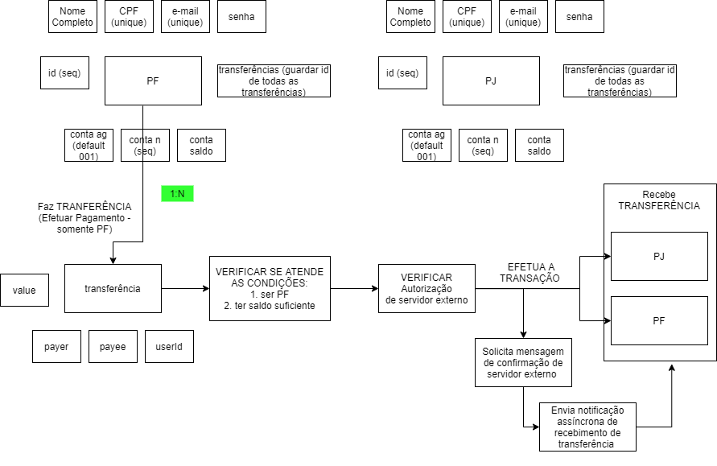

# Pockect Bank

## Introduction

Aplicação simplificada de transferências entre seus usuários (back-end). 

## Como funciona? 

- 2 tipos de usuários: PF ou PJ,
- PF podem transferir e receber pagamentos. 
- PJ apenas recebem pagamentos. 
- transferências permitidas apenas se houver saldo suficiente para a transação em questão.
- Conexão com serviço autorizador externo para validar a transferência. 
- Conexão assíncrona com serviço de terceiro para envio de notificação de recebimento de pagamento ao usuário (email, sms).

## Diagrama Estrturação da Aplicação

## Techs used
- JavaScript
- Nodejs
- MongoDB
- Express
- Axios
